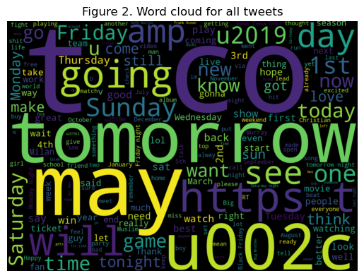
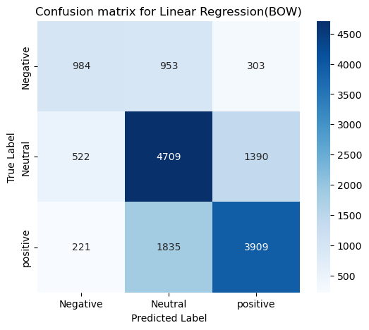
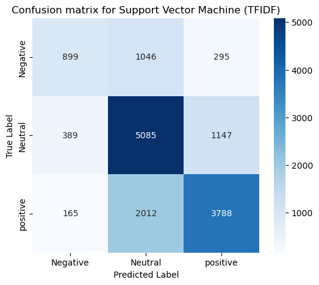

# 💼 Classification of Sentiments of Tweets  
> Determining and classifying sentiment in tweets using machine learning models

---

## 📌 Table of Contents  
- [Overview](#🧩-overview)  
- [Business Objective](#🎯-business-objective)  
- [Dataset](#📊-dataset)  
- [Tools & Techniques](#🛠️-tools--techniques)  
- [Exploratory Data Analysis](#🔎-exploratory-data-analysis)  
- [Feature Engineering](#🏗️-feature-engineering)  
- [Modeling](#🤖-modeling)  
- [Results & Insights](#📈-results--insights)  
- [Dashboard / Visuals](#📊-dashboard--visuals)  
- [Conclusion](#🧾-conclusion)  
- [Next Steps](#🔄-next-steps)  
- [Author](#👨‍💻-author)  

---

## 🧩 Overview  

This project tackles the **SemEval-2017 Task 4A** challenge: sentiment classification of English-language tweets. The goal is to classify each tweet as **positive**, **neutral**, or **negative** using supervised machine learning models.  

### Key Points:
- **Data Source**: Official SemEval-2017 competition dataset  
- **Problem Type**: Multi-class classification  
- **Approach**: Feature extraction (BoW, TF-IDF) + ML modeling  
- **Impact**: Understand public opinion at scale using natural language processing  

---

## 🎯 Business Objective  

> To develop a robust sentiment analysis model that helps social media teams, marketing professionals, or political analysts to gauge public sentiment efficiently from large-scale tweet data.  

---

## 📊 Dataset  

- **Source**: [SemEval-2017 Task 4A](http://alt.qcri.org/semeval2017/task4/)  
- **Size**: 50,043 tweets  
- **Time Period**: 2017  
- **Target Variable**: `Sentiment` (Positive, Neutral, Negative)  

---

## 🛠️ Tools & Techniques  

| **Category**       | **Tools Used**                                  |
|--------------------|--------------------------------------------------|
| Language           | Python                                           |
| Data Handling      | `pandas`, `numpy`                                |
| Feature Extraction | `CountVectorizer`, `TfidfVectorizer`            |
| Modeling           | `scikit-learn`, `xgboost`                        |
| Visualization      | `matplotlib`, `seaborn`                          |

---

## 🔎 Exploratory Data Analysis  

Exploration focused on:
- Class distribution (slight imbalance toward neutral)
- Common words per sentiment class
- Tweet length distributions  

📌 *Visualizations included:*  
- Sentiment distribution bar chart  
- Word clouds for each sentiment category  

---

## 🏗️ Feature Engineering  

- **Text Cleaning**: Lowercasing, punctuation removal, tokenization  
- **Vectorization**:  
  - Bag of Words (BoW)  
  - TF-IDF (Term Frequency–Inverse Document Frequency)  

These representations capture important patterns while reducing noise.

---

## 🤖 Modeling  

Five machine learning models were evaluated:
1. **Logistic Regression**  
2. **Support Vector Machines (SVM)**  
3. **XGBoost**  
4. **Random Forest**  
5. **Naive Bayes**  

📌 *Evaluation Metrics*:
- Average Recall
- Average F1 Score of Positive and Negative Tweets (F1_pn)  

📊 *Top three models*:

| **Model**              | **Average Recall** | **F1_pn** |
|------------------------|--------------------|-----------|
| Support Vector Machine (TFIDF) | 0.60              | 0.59         |
| Logistic Regression (BOW)    | 0.60               | 0.59         |
| Support Vector Machine (BOW)| 0.60              | 0.58         |

---

## 📈 Results & Insights  

- **TF-IDF + SVM** gave the best overall performance.  
- **Key Insight**: Support vector machines emerged as the best classifier with both feature representations. This highlights its suitability for text classification tasks.
---

## 📊 Dashboard / Visuals  
- Word Cloud of All tweets

-Confusion Plot of Top two models

  

---

## 🧾 Conclusion  

- **What worked**: TF-IDF combined with ensemble methods like XGBoost.  
- **Business Value**: Enables brands or political groups to quantify sentiment at scale with minimal human effort.  

---

## 🔄 Next Steps  

- Apply deep learning (e.g., LSTM or BERT-based models) for more contextual understanding  
- Expand the dataset with more recent tweets  
- Build a web app for live sentiment analysis  

---

## 👨‍💻 Author  

**Olabanji Olaniyan**  
Data Scientist  
📫 [LinkedIn](https://www.linkedin.com/in/olabanji-olaniyan-59a6b0198/) | [Portfolio](https://banjiola.github.io/Olabanji-Olaniyan/)
